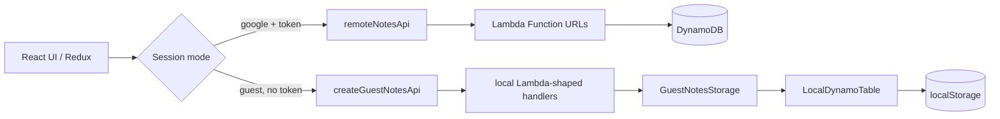

# Guest mode architecture

Guest mode is a deliberately isolated, browser-only demonstration path. It
lets a visitor exercise the note list and editor without Google OAuth while
leaving the existing authenticated Lambda/DynamoDB path unchanged.

## Try it

Open the [live demo](https://lotionv2.netlify.app), select **Try the demo as a
guest**, and use the seeded notes or create one of your own. Guest mode is
not an anonymous account: it has no server identity, cloud backup, or access
to authenticated notes.

## The `NotesApi` seam

`src/api/notesApi.ts` is the boundary used by note CRUD code:

```ts
getNotes(session) -> { notes, count }
saveNote(session, note) -> note
deleteNote(session, noteId) -> noteId
```

`createNotesApi` selects `remoteNotesApi` for a Google session and a
guest-only implementation when a `GuestNotesStorage` adapter is supplied. A
guest session without that adapter fails closed with a configuration error; it
cannot fall through to a remote request. The remote implementation still
requires a Google token and sends the existing email/token headers to the
three Lambda Function URLs.

The guest implementation also validates the session: it requires `mode:
"guest"`, a non-empty guest marker (`guest@lotion.local` by default), and no
access token. Guest handlers reject token-bearing requests and reject notes
whose email does not match the guest session.

## Lambda + DynamoDB emulation

The production path is React/Redux → `NotesApi` → Lambda Function URL →
DynamoDB. Guest mode preserves the same request/response shape without
pretending to be a cloud deployment:

1. `createGuestNotesApi` invokes the local `get-notes`, `save-note`, and
   `delete-note` handler functions.
2. Those handlers use the same method, session, body, status-code, and JSON
   validation style as a small Lambda boundary.
3. The supplied browser adapter persists through `localStorage` rather than
   making a network call.
4. `LocalDynamoTable` is a small DynamoDB-shaped table utility for tests and
   alternate adapters: it supports a string partition key (`email`), numeric
   sort key (`id`), query, put, delete, generated IDs, reset, and storage
   events. It is an emulation, not AWS DynamoDB and not a second backend.

This arrangement makes the seam testable and keeps guest traffic out of
protected Lambda URLs.



## Storage schema and lifecycle

The browser adapter uses the guest-only key
`lotion:guest:v1:table:Notes` and stores a composite-key object:

```json
{
  "guest@lotion.local": {
    "1": {
      "id": 1,
      "Title": "Welcome to Lotion",
      "Content": "…",
      "email": "guest@lotion.local",
      "when": "October 8, 2026, 9:00 AM"
    }
  }
}
```

Reads normalize numeric string IDs, validate note fields, and recalculate
`count`. Missing, malformed, or unknown-shape data is treated as an empty
store. A new guest entry starts fresh and seeds five example notes. Explicit
guest logout wipes the guest key; **Reset demo** also replaces it with the
seed data. The session marker itself lives in
`sessionStorage`, so a browser tab refresh can restore the guest session while
the tab's guest identity is active.

## Limits and privacy expectations

- Guest notes remain in this browser/device; they do not sync across tabs or
  devices, have no recovery path, and are not shared with other users.
- Guest mode never calls Google OAuth, Lambda URLs, or DynamoDB. It cannot see
  or modify an authenticated account's notes.
- Starting a fresh guest session and leaving guest mode intentionally discard
  guest data. Do not use guest mode as durable storage.
- Browser storage can be unavailable, cleared by privacy settings, or hit a
  quota. The adapter reports storage failures; the demo has no server-side
  quota or multi-user collaboration.
- The current schema is version 1 and has no migration beyond rejecting
  unknown versions. Future schema changes must migrate explicitly.

## 30-second demo script

1. Open the [live demo](https://lotionv2.netlify.app) and point out the
   **Try the demo as a guest** button.
2. Click it: no OAuth prompt appears and seeded notes load.
3. Open a note, edit its title/content, and save.
4. Create a new note, then delete it to show full local CRUD.
5. Refresh to show the guest session and notes persist in the browser.
6. Click **Reset demo data** (or leave guest mode) to show the documented reset
   behavior, then mention that Google sign-in enables the cloud-backed path.

## Suggested GitHub About metadata

**Description**

> A React + AWS serverless Notion-style notes app with an isolated,
> browser-local guest demo—try it without logging in.

**Topics**

`react` `redux-toolkit` `typescript` `aws-lambda` `dynamodb` `terraform`
`serverless` `google-oauth` `netlify` `notion-clone` `guest-mode`
